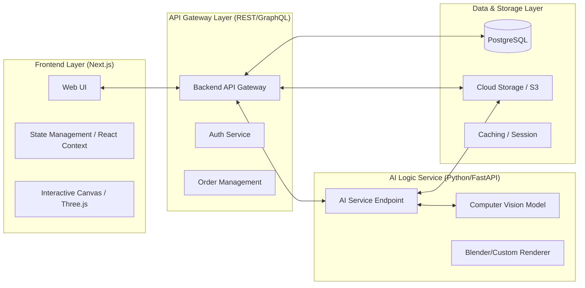

# CarpetViz System Architecture

This document details the production-grade architecture for the CarpetViz platform, ensuring scalability, isolation of AI logic, and a seamless user experience.

---

## 1. High-Level Component Diagram



---

## 2. Technical Stack

| Component | Technology | Reason |
| :--- | :--- | :--- |
| **Frontend** | Next.js (React), Tailwind CSS | Fast SSR/ISR, SEO optimization for e-commerce. |
| **State Management** | Zustand or Redux Toolkit | Managing complex UI states during rug visualization. |
| **Interactive Overlay** | Three.js or Fabric.js | Enabling move/rotate/scale transformations on the client-side. |
| **Backend API** | Node.js (NestJS) or Go | High concurrency for handling product catalogs and orders. |
| **AI Processing** | Python (FastAPI), PyTorch/TensorFlow | Industry standard for CV models (Plane detection, Lighting). |
| **Database** | PostgreSQL | Relational data for products, users, and orders. |
| **Storage** | AWS S3 + CloudFront | Low-latency delivery of high-res assets globally. |

---

## 3. Data Flow: "View in Room" Action

1. **Upload**: User uploads room photo `room_01.jpg` (Frontend -> S3 via Presigned URL).
2. **Request**: Frontend sends `POST /api/v1/visualize` with `{ room_url: "...", rug_id: "rug_abc", dimensions: { w: 8, h: 10 } }`.
3. **Queue/Process**: API Gateway validates the request and forwards it to the AI Service.
4. **AI Analysis**:
   - **Segmenter**: Identifies floor vs. furniture.
   - **Plane Estimator**: Calculates the vanishing points and ground plane.
   - **Warper**: Applies homography to the rug PNG.
   - **Compositor**: Blends the warped rug onto the room image with shadows.
5. **Response**: AI Service returns `rendered_image_url`.
6. **Client-Side Enhancement**: The Frontend loads the rendered image and overlays an interactive layer (using Three.js) for micro-adjustments by the user.

---

## 4. API Specification (Internal Handoff)

### `POST /api/v1/visualize`
**Request Body:**
```json
{
  "room_image_url": "https://s3.amazonaws.com/carpetviz-uploads/room_123.jpg",
  "rug_image_url": "https://s3.amazonaws.com/carpetviz-assets/rug_premium_01_alpha.png",
  "config": {
    "unit": "ft",
    "width": 8,
    "height": 10,
    "initial_rotation": 0
  }
}
```

**Response Body:**
```json
{
  "status": "success",
  "request_id": "viz_889900",
  "result_url": "https://s3.amazonaws.com/carpetviz-renders/result_123.jpg",
  "metadata": {
    "floor_detected": true,
    "confidence_score": 0.98,
    "perspective_matrix": [1, 0, 0, 0, 1, 0, 0, 0, 1]
  }
}
```

---

## 5. Security & Performance

- **Asset Protection**: Use signed URLs for user-uploaded room images to ensure privacy.
- **AI Latency**: Implement a "loading" state on the frontend with optimistic UI or progress updates via WebSockets for long-running AI tasks.
- **Edge Caching**: Product assets (rug PNGs) are cached at the edge (CDN) to minimize latency during the visualization step.
- **Admin Security**: The Admin Dashboard is protected by Role-Based Access Control (RBAC).
