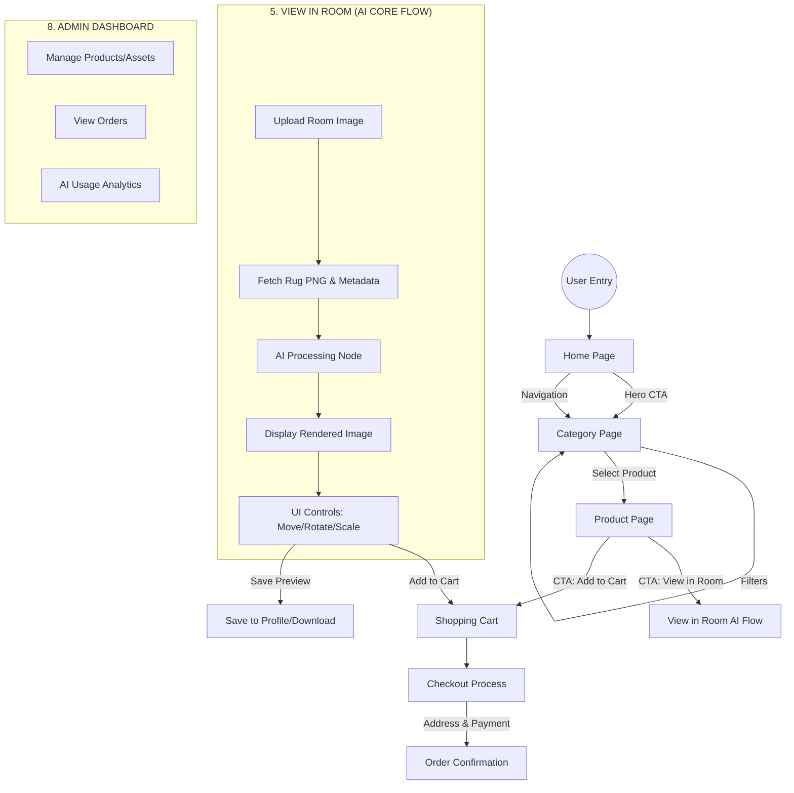
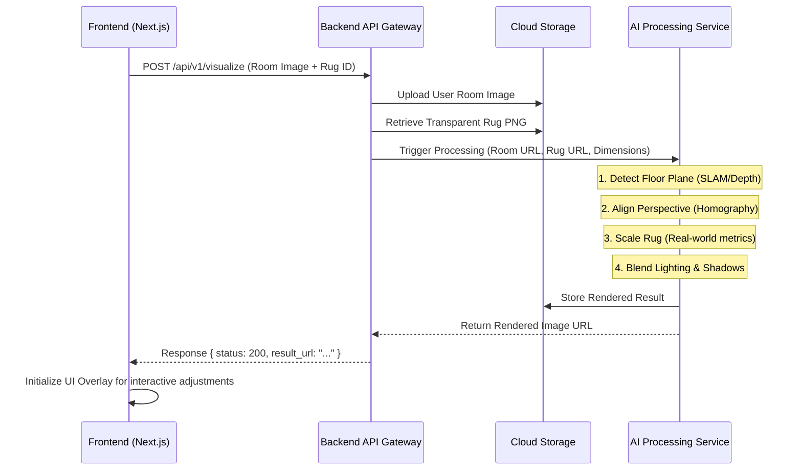

# CarpetViz: AI-Powered Rug Visualization Platform Workflow

This document outlines the production-ready workflow for **CarpetViz**, a luxury e-commerce platform that integrates advanced AI visualization.

---

## 1. Core User Journey

The following diagram represents the end-to-end user experience from discovery to purchase.

---

## 2. AI Processing Pipeline (Isolated Service)

The AI logic is treated as a specialized service. It receives raw inputs and returns a processed visualization.

---

## 3. Workflow Node Definitions

### 1. User Entry & Home Page
- **Inputs**: URL Access (Desktop/Mobile).
- **Navigation**: Hero section with deep-link to "View in Room" demo or top collections.
- **Logic**: Device detection to optimize image loading.

### 2. Category & Product Pages
- **Filters**: State-managed filtering by size, color, material, and price.
- **Data Handoff**: Product Page receives `product_id` and fetches high-res gallery and transparent PNG assets.

### 3. View in Room (The AI Core)
- **User Input**: Uploaded `.jpg/.png` of a room.
- **AI Processing**:
    - **Floor Detection**: Identifies the surface area where the rug should be placed.
    - **Perspective Mapping**: Warps the 2D rug PNG to match the 3D room coordinates.
    - **Occlusion Handling**: (Advanced) Detects furniture legs or objects to place the rug *under* them if necessary.
    - **Shadow Synthesis**: Generates realistic drop shadows based on detected room lighting.
- **Interactive UI**: After initial render, user can drag (translate), rotate, and scale.

### 4. Cart & Checkout
- **Data Combination**: The cart item includes standard product metadata plus a reference to the `ai_generated_preview_url` for a personalized touch.
- **Output**: Order confirmation with the "View in Room" preview saved in the user's order history.

### 5. Admin Dashboard
- **Product Ingestion**: Admin uploads:
    - Standard gallery images.
    - **Alpha-masked Transparent PNG** (Crucial for AI overlay).
    - Physical dimensions (e.g., 8' x 10') for accurate scaling.
- **Analytics**: Monitoring AI service latency and conversion rates from "View in Room" users vs. standard users.

---

## 4. System Architecture Constraints

- **Decoupling**: The Frontend communicates with the Backend via REST. The Backend handles the heavy lifting of communicating with the AI Service asynchronously (or via synchronous high-performance endpoints).
- **Scalability**: AI nodes can be scaled independently based on GPU demand.
- **Storage**: All images (User uploads, Rug assets, Final renders) are stored in Cloud Storage (e.g., AWS S3, Google Cloud Storage) with CDN delivery.
